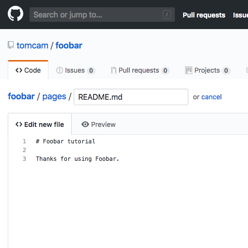
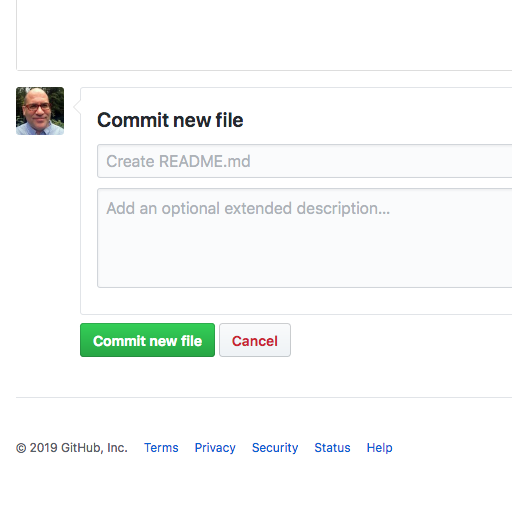
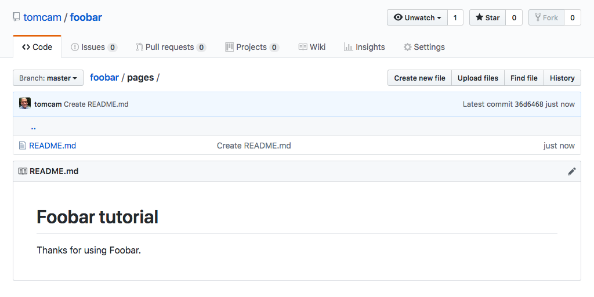

# Creating a GitHub Account

You only need to do this once:

* First [Join GitHub](https://github.com/join). It's free.

Your GitHub account is allowed unlimited public projects.
This guide shows how to create a GitHub Pages site from a public project.

## Creating a repository for your projects

* Choose the **+** symbol, then **New repository**.

The **Create a new repository** page appears.


On some configurations you may see the **Start a project** button, so click it if so.


* Give the repository a name. Normally it's best to use lowercase letters, numbers. Instead of spaces and hyphen characters (the minus sign, or `-`) instead. It will be used as a filename, and it will be given prominence in Web searches.

## TODO: Mention no README or license required

* Leave **Public** checked, then choose **Create repository**

## Create a file named /docs/README.md 

The first thing needed is to create a file named specifically `README.md` capitalized exactly as shown, 
and it must go in a directory named `/docs`. Sites like the one you're creating with GitHub Pages often accompany
code for a software project and `/docs` is the logical locaqtion.

Another advantage is that if you want to use 
Jekyll features it's expected by that CMS as well.

GitHub pages sites use directory structures. Each subdirectory with pages you want published must contain
a README.md file, which will be silently converted to `index.html` files.

* Under **Quick setup — if you’ve done this kind of thing before** it says
`Get started by creating a new file or uploading an existing file. We recommend every repository include a README, LICENSE, and .gitignore`. Choose the `creating a new file` link:


An edit window appears letting you type the filename *and also the path*.


* Enter `docs/README.md` and you'll see how GitHub separates the path and filename
interactively, visually distinguishing each level of the directory
hierarchy:


### All pages have headers and text

Create a page that looks something like this. It doesn't matter what you write,
as long as you start the first line with a hash tag and a space, like so: `# `

```
# Please start here

Thanks for using our product.
```

The `# ` signfies a level 1 header. The text underneath it is plain text.

Let's call this page done for now. 

* At the bottom of the page choose **Commit new file**.

You can optionally put a brief note in the top line (50 characters or less by convention)
and a longer explanation under it.

Github shows the page rendered as HTML:


### Choose source: master branch /docs folder

* Find the section named **GitHub Pages**, and choose  **Source**.

A list of options appears. Choose **master branch /docs folder**.


* When you're finished, click the area below that says **Create branch: gh-pages**.


The button should now say **Branch: gh-pages**.

## Creating a /pages directory with a README.md file in it

A Quick setup page appears. You'll see a message that says `Get started by creating a new file or uploading an existing file.`

The source code for your site must be in a directory called `/pages` but there's no way to
create a directory without a file in GitHub. You must enter a filename but precede it
with a directory name (`pages`) in this case. The directory name will get created
automatically.

Luckily you need a file. All GitHub Pages directory with files meant to appear in the website
must have a file named `README.md` in them.

* Click `creating a new file`.


* Start typing the directory name, `pages`:


Here's where the directory gets created.

* Type a slash character (`/`), then the name of the file, `README.md` in this case:


* You've now created a file named README.md in the `/pages` directory of the repo.

* Add a line starting with the pound sign/hash tag. It's a title that will be converted
to an HTML `<h1`> tag, so something like `# Foobar tutorial`. Then add a blank line, followed by some 
text, say, `Thanks for using Foobar`. Here's what it will look like:



When you're finished, click **Commit changes** at the bottom of the page. 
Normally you'd put a comment there, but the default (`Create README.md`) does the job
just fine.



After it's saved you see a preview:



If you wanted you could edit the file again by choosing the pencil icon.

