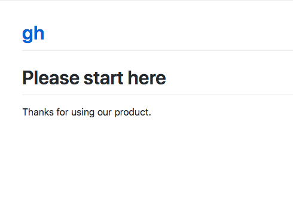

# The Least You Need to Know About GitHub Pages

View in [Github Pages](https://tomcam.github.io/least-github-pages/) or directly on [Github](https://github.com/tomcam/least-github-pages/) 

This guide shows you how to create information-heavy websites quickly 
and interactively using GitHub Pages right on the GitHub website. You
don't need to learn command-line programs like Git or install anything
on your own computer.

GitHub Pages is free if your repository (file storage area) is public.

## Intended audience

GitHub Pages uses [Jekyll](https://jekyllrb.com), a publishing system based on the Ruby programming language. The Jekyll documentation is excellent, especially if you already know Jekyll, program in Ruby, and have both Ruby and Jekyll installed on your local computer. The GitHub Pages documentation is comprehensive and excellent--if you're already a Jekyll expert.

[The Least You Need to Know About GitHub Pages](./) is designed for people who don't happen to know Jekyll already but who need to get up to speed in GitHub Pages quickly to get a job done *now*. It tells you not only what to do step by step,
but also briefly explains why you take each step.

## What you'll end up with

If you follow through the steps in this guide you'll have a small website showing everything you need to put up an attractive, easy to maintain site using words, links, and images. Not covered are advanced topics such as custom themes, SEO, advanced linking techniques, and so on.

### Advantages to using GitHub Pages

Still wondering whether to use GitHub Pages?

If you're not sure about the advantages of using GitHub pages, see [Why Use GitHub Pages?](github-pages-advantages.md)

### Disadvantages to using GitHub Pages

If you want to understand why GitHub pages may not suite your project, see [When to avoid GitHub pages](github-pages-disadvantages.md).

## What this GitHub pages tutorial covers

This short GitHub shows in just a few pages how to:

* [Create a GitHub Account](#creating-a-github-account)
* [Create a GitHub repository](#creating-a-repository-for-your-projects)
* Create web pages by typing using a convention called Markdown, which lets
you type `# The Least You Need to Know About GitHub Pages` and see it 
rendered as an HTML page, as shown in the headline above.
* Publish your pages as a GitHub Pages website
* Link to other pages on your site
* Link pages to other sites or other pages on your own site
* Change the appearance of your site using Jekyll themes

If you're ready to start, click for the [GitHub Pages Tutorial](README.md).
If you're not sure why you should use GitHub, read on.

## Creating a GitHub Account

You only need to do this once:

* First [Join GitHub](https://github.com/join). It's free.

Your GitHub account is allowed unlimited public projects.
This guide shows how to create a GitHub Pages site from a public project.

## Creating a repository for your projects

* Choose the **+** symbol, then **New repository** (or just click this [Create new repository](https://github.com/new) link).

The **Create a new repository** page appears.


On some configurations you may see the **Start a project** button, so click it if so.


* Give the repository a name. Normally it's best to use lowercase letters, numbers. Instead of spaces and hyphen characters (the minus sign, or `-`) instead. It will be used as a filename, and it will be given prominence in Web searches.

* Leave **Public** checked, then choose **Create repository**. Feel free to add a descripion if you wish.

## Creating the first page at /docs/README.md 

The first thing needed is to create a file named specifically `README.md` capitalized exactly as shown, 
and it must go in a directory named `/docs`. Sites like the one you're creating with GitHub Pages often accompany
code for a software project and `/docs` is the logical location.

Jekyll also expects your text to be in that directory as well.

GitHub pages sites use directory structures. Each subdirectory with pages you want published must contain
a README.md file, which will be silently converted to `index.html` files.

* Under **Quick setup — if you’ve done this kind of thing before** it says
`Get started by creating a new file or uploading an existing file. We recommend every repository include a README, LICENSE, and .gitignore`. Choose the `creating a new file` link:


* Enter `docs/README.md` and you'll see how GitHub separates the path and filename
interactively, visually distinguishing each level of the directory
hierarchy:


All GitHub Pages directories with files meant to appear in the website
must have a file named `README.md` in them.

## All pages have headers and text

Create a page that looks something like this. It doesn't matter what you write,
as long as you start the first line with a hash tag and a space, like so: `# `

```
# Please start here

Thanks for using our product.
```

The `# ` signfies a level 1 header. The text underneath it is plain text.

Let's call this page done for now. 

* At the bottom of the page choose **Commit new file**.

You can optionally put a brief note in the top line (50 characters or less by convention)
and a longer explanation under it.

Github shows the page rendered as HTML:


## Set master branch to /docs folder 

GitHub Pages and Jekyll prefer you to use a directory structure 
starting not in the root directory but in `/docs`. Inserting `/docs`
before in a path can get old. GitHub lets you avoid this by establishing it
as the base directory for your documentation site.

* From the list of sections on the middle of the page choose **Settings**:


* Find the section named **GitHub Pages**, and choose  **Source**.

* Choose **master branch /docs folder**.

Changing the master branch to `/docs` means you will be able to avoid specifying the `/docs` folder at the base of every link.

## Your site is now on GitHub Pages at github.io

A new message appears above it in the **GitHub Pages** section, saying **Your site is ready to be published at ...**, 
followed by a link. 

```
✓ Your site is published https://tomcam.github.io/gh/
```

As you can see, there's a pattern. A github project at `https://github.com/mycoolname/bigdocument` appears
on `https://mycoolname.github.io/bigdocument`

## Open the page in GitHub pages

* Open that link in a new browser tab:



Congratulations. Your source code is now being run through Jekyll 
at GitHub. You can edit it using GitHub's interactive editor, and
Jekyll is automatically run when the source code changes.

[Create a new page and link to it](new-page.md)
