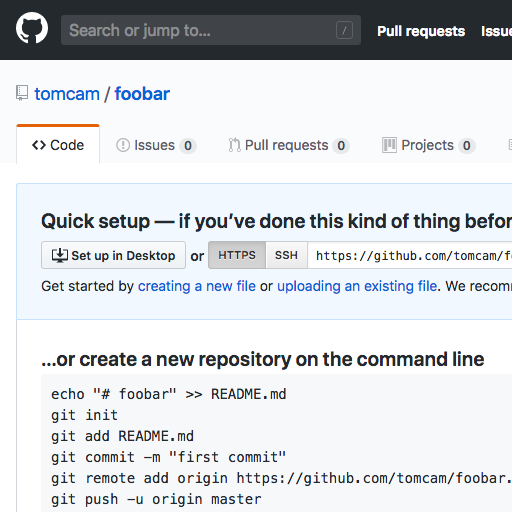

# Creating a GitHub Account

You only need to do this once:

* First [Join GitHub](https://github.com/join). It's free.

Your GitHub account is allowed unlimited public projects.
This guide shows how to create a GitHub Pages site from a public project.

## Creating a repository for your projects

* Choose the **+** menu, then **New repository**.

The **Create a new repository** page appears.

* Give it a name made up of lowercase letters, numbers, and hypen characters (the minus sign, or `-`) instead
of spaces. It will be used as a filename, and it will be given prominence in Web searches.

* Leave **Public** checked, then choose **Create repository**

You're not done yet!

## Creating a /pages directory with a README.md file in it

A Quick setup page appears. You'll see a message that says `Get started by creating a new file or uploading an existing file.`

The source code for your site must be in a directory called `/pages` but there's no way to
create a directory without a file in GitHub. You must enter a filename but precede it
with a directory name (`pages`) in this case. The directory name will get created
automatically.

Luckily you need a file. All GitHub Pages directory with files meant to appear in the website
must have a file named `README.md` in them.

* Click `creating a new file`.

* Start typing the directory name, `pages`:

Here's where the directory gets created.

* Type a slash character (`/`), then the name of the file, `README.md` in this case:

* You've now created a file named README.md in the `/pages` directory of the repo.

* Add a line starting with the pound sign/hash tag. It's a title that will be converted
to an HTML `<h1`> tag, so something like `# Foobar tutorial`. Then add a blank line, followed by some 
text, say, `Thanks for using Foobar`. Here's what it will look like:

When you're finished, click **Commit changes** at the bottom of the page. 
Normally you'd put a comment there, but the default (`Create README.md`) does the job
just fine.

