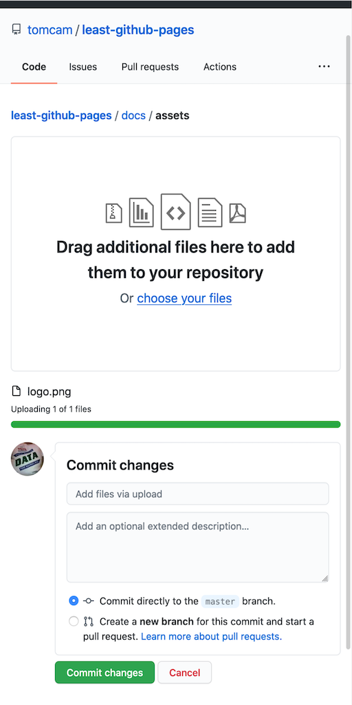

# Adding images to your GitHub Pages site

The Jekyll publishing system used by GitHub Pages expects you to have an `assets` 
directory, and that's where image files should be placed. By convention they go into an
`images` subdirectory (full path `/docs/assets/images` but that's not a firm requirement.
They can be anywhere in the `/docs/assets` path.

## Create a directory called /docs/assets

* If you haven't yet created an assets directory, read 
[Adding an assets directory GitHub Pages](https://github.com/tomcam/least-github-pages/blob/master/docs/adding-assets-directory-github-pages.md)
and follow those steps to create a directory at `/docs/assets`.

## Upload images to the /docs/assets directory

* On GitHub, navigate to the `/docs/assets` directory.

* Click the **Add file** button, then choose **Upload files**

* Upload one or more files, then click **Commit changes**

