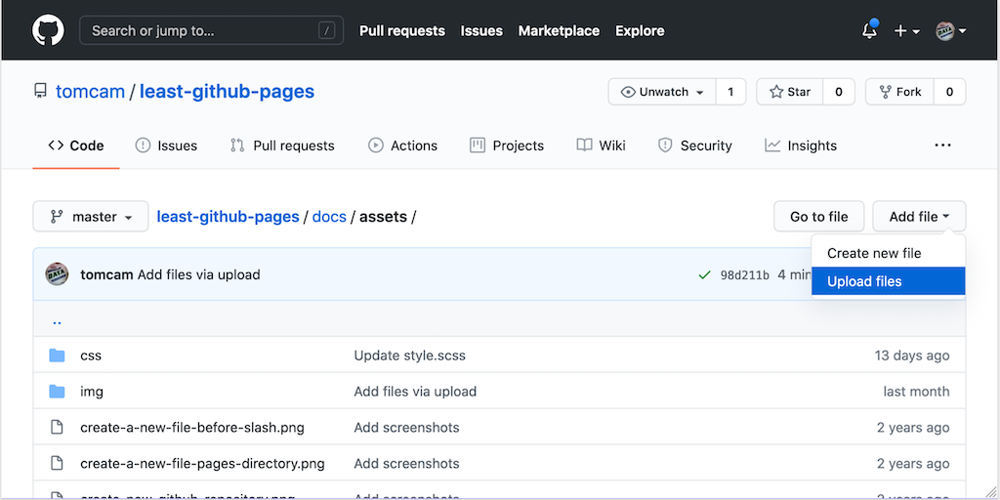

# Adding images to your GitHub Pages site

The Jekyll publishing system used by GitHub Pages expects you to have an `assets` 
directory, and that's where image files should be placed. By convention they go into an
`images` subdirectory (full path `/docs/assets/images` but that's not a firm requirement.
They can be anywhere in the `/docs/assets` path.

## Create a directory called /docs/assets

* If you haven't yet created an assets directory, read 
[Adding an assets directory to GitHub Pages](https://github.com/tomcam/least-github-pages/blob/master/docs/adding-assets-directory-github-pages.md)
and follow those steps to create a directory at `/docs/assets`.

## Upload images to the /docs/assets directory

* On GitHub, navigate to the `/docs/assets` directory.

* Click the **Add file** button, then choose **Upload files**



* Upload one or more files, then choose **Commit changes** at the bottom of the page.


## Add proper Markdown to display the image

Now insert Markdown text to specify an image. It's the same as for a link, but preceded by a `!` character.
For example, if you want to show a file named `logo.png` in the `assets` directory (really `/docs/assets` in this example),
you'd employ this Markdown. Note that the text in between the `[` and `]` should be a clear description of the
image. It's used by screen readers for visually impaired users.

```

```

### Example of the example link in action


[Previous page](github-pages-jekyll-themes.md) |  [Next page](github-pages-url.md)

#### [Home](./README.md) 
