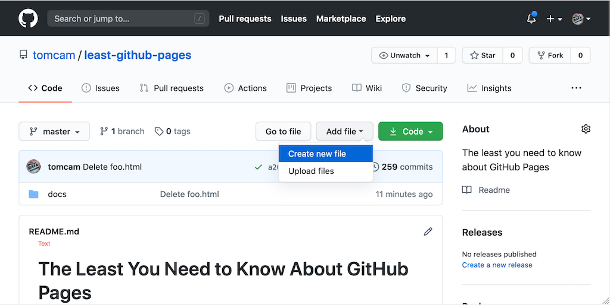
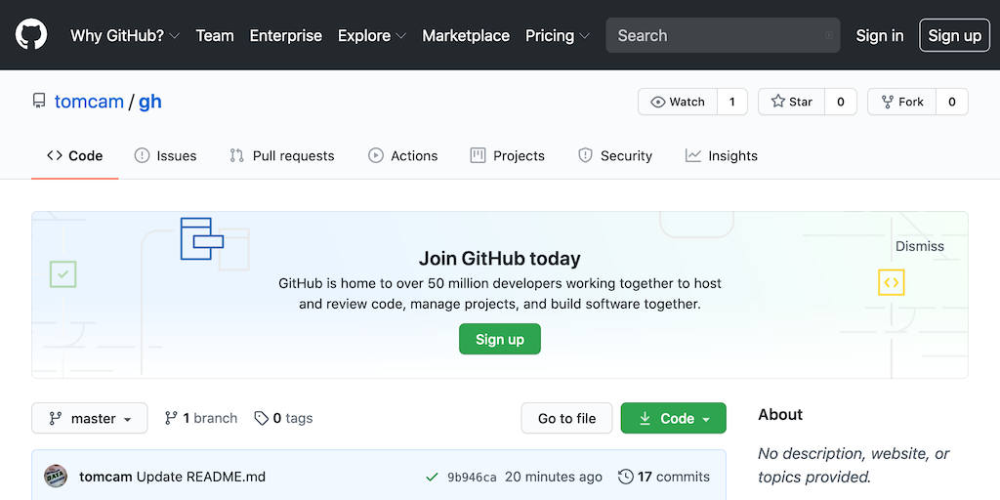

# Creating a new file on GitHub

* Choose the **Add file ▾** button.

A dropdown appears with **Create new file** and **Upload files** options.



* Choose **Create new file**.

This built-in feature of GitHub lets you create files interactively by typing right on the web page.
It's only for text files, but GitHub gives you different preview results based on the file
extension. For example, it shows basic highlighting if the file ends in `.md` because it
assumes a Markdown file. If the file ends in a programming language extension known to Git, 
say, `.js` for Javascript, it highlights the code. 
If the file ends in `.txt` or other unknown extension, it shows no formatting.

* Enter a name such as `tutorial/start.md` and you'll see how GitHub separates the path and filename
interactively, visually distinguishing each level of the directory
hierarchy. This goes only one level down but you can go as deep as necessary.


## Directory creation on GitHub is so easy it's worth a second look

Let's look at how simple it was to create a directory interactively on GitHub and review some things.
* **When you're creating a path with a new directory, you must always create a file too.** 
Git doesn't allow empty directories in a repository, so GitHub doesn't either.
* **You can backspace to go higher in the directory tree** If you backspace enough so that
the directory name is erased, GitHub won't create that directory. 
Obviously it won't delete an existing directory that has files in it.

* Add some Markdown text

In the edit area, add the following text (or something like it; the literal words don't matter):

```
# Please start here

Welcome, and thanks for choosing our product.

If you want to dive right in, try our [quick start tutorial](./). 
```

## Save (commit) your file

* At the bottom of the page choose **Commit new file**.

You can optionally put a brief note in the top line (50 characters or less by convention)
and a longer explanation under it. This comes in handy later when you have multiple
people working on the same document, or when you want a record later of why you
made a change to a document.

Why doesn't it just say **Save**? Because GitHub keeps a complete history of your document.
You will be able to restore to any commit point in history if you wish. Your audience will
also be able to suggest changes using GitHub Issues, and you'll be able to link to those
issues easily if you wish.

## See your document in preview mode

After clicking **Commit changes** you are now looking at your file in preview mode. 
GitHub's preview mode displays all Markdown files like this, whether they are using its built-in Jekyll themes or not.
Github generates HTML based on the Markdown and renders the page based on the theme you've chosen,
which in this case is the default:



If you click the link you'll be redirected to the current directory. It's just there to show how a link looks.

[Back](/README.md)
