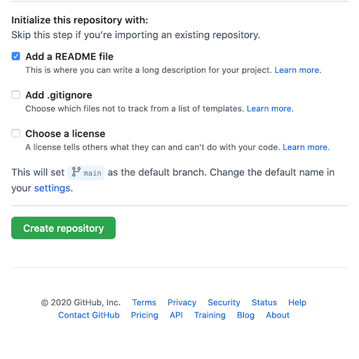

# Creating a GitHub repository for your projects

The GitHub *repository*, also konwn as a *repo*, stores your project and its entire history. 
Git allows you to go back to any commit point and reconstruct your project up to that point.
On GitHub it also has many other features, such as an effective bug/feature reporting system
called Issues, a built-in Wiki, and easy ways for other people to check out their own
versions of your (public) repository and create their own versions, then offer them back
to you if they wish.

* Choose the **+** symbol, then **New repository** (or just click this [Create new repository](https://github.com/new) link).

The **Create a new repository** page appears.


On some configurations you may see the **Start a project** button, so click it if so.


* Give the repository a name. Normally it's best to use lowercase letters, numbers. Instead of spaces and hyphen characters (the minus sign, or `-`) instead. It will be used as a filename, and it will be given prominence in Web searches.

* Leave **Public** checked.

* Feel free to add a descripion if you wish.

* Under **Initialize this repository with** check **Add a README file**:



* Choose **Create repository**. 

<a id="repo-url"></a>

## The GitHub repository URL is always https://github.com/{userid}/{reponame}

GitHub repositories all use the same naming convention, which is `https://github.com/{userid}/{reponame}`:

* Starting with with the Github URL followed by a `/` slash:

```
https://github.com/
```

* Followed by your GitHub username/account name, then by a `/` slash. The creator of this repo has the GitHub username `tomcam`, for example, so you'd have:

```
https://github.com/tomcam/
```

* Followed by the name of the repo, in this case `least-github-pages`.  The completed URL would be:

```
https://github.com/tomcam/least-github-pages
```

## Example repo URLs

* The name of the Microsoft Visual Studio Code repository is https://github.com/microsoft/vscode
* The name of the Twitter Bootstrap CSS framework repository is https://github.com/twbs/bootstrap
* The name of the https://FreeCodeCamp.org repo is https://github.com/freeCodeCamp/freeCodeCamp

The reason to beat you over the head with this is that your published website will follow its own URL naming convention, and it's easy to derive one from the other.

[Previous page](creating-github-account.md) |  [Next page](enable-github-pages.md)


#### [Home](./README.md) 

