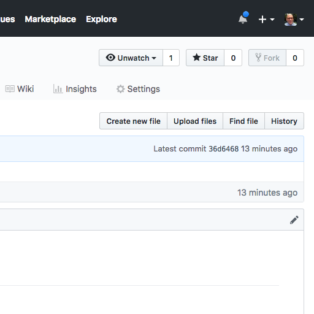

# Enable GitHub Pages

[GitHub Pages](https://pages.github.com/) hasn't been enabled yet.
Doing so will let you apply the powers of Jekyll to the markup files you've created.

* Choose the **Settings** gear icon for your repository near the upper right of the page.

The **Settings** page appears.

* Scroll down to the section called **GitHub Pages**

You'll see **Source** subheading and a button that says **None**.

* In the next button choose **/docs**.

* Choose the **Save** button.
