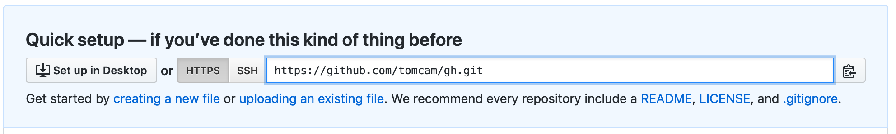
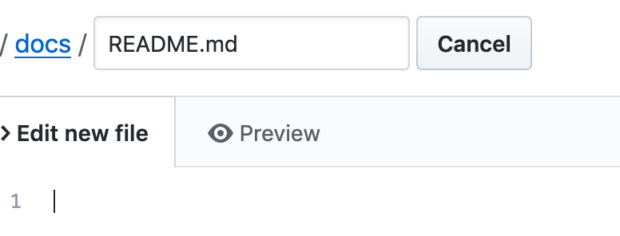

# Create the main GitHub Pages README file in /docs/README.md 

The first thing needed is to create a file named specifically `README.md` capitalized exactly as shown, 
and if you're using GitHub Pages, you should put it in a directory named `/docs`. 
Sites like the one you're creating with GitHub Pages often accompany code for a software project and `/docs` is the logical location.

More important, Jekyll expects your text to be in that directory as well.

GitHub pages sites use directory structures. Each subdirectory with pages you want published must contain
a README.md file, which will be silently converted to `index.html` files.

* Under **Quick setup — if you’ve done this kind of thing before** it says
`Get started by creating a new file or uploading an existing file. We recommend every repository include a README, LICENSE, and .gitignore`. 
Choose the `creating a new file` link:



* Enter `docs/README.md` and you'll see how GitHub separates the path and filename
interactively, visually distinguishing each level of the directory
hierarchy:



All GitHub Pages directories with files meant to appear in the website
must have a file named `README.md` in them.

* Add some Markdown text

In the edit area, add the following text (or something like it; the literal words don't matter):

```
# Please start here

Welcome, and thanks for choosing our product.

If you want to dive right in, try our [quick start tutorial](./). 
```

## Save your changes

* Save the changes to your text by choosing the **Commit changes** button.

Why doesn't it just say **Save**? Because GitHub keeps a complete history of your document.
You will be able to restore to any commit point in history if you wish. Your audience will
also be able to suggest changes using GitHub Issues, and you'll be able to link to those
issues easily if you wish.

## See your README.md in preview mode

After clicking **Commit changes** ou are now looking at your newly edited `/docs/README.md` file in preview mode. GitHub's preview mode displays all Markdown files like this, whether they are using its built-in Jekyll themes or not.


If you click the link you'll be redirected to the current directory. It's just there to show how a link looks.

## GitHub pages pretends /docs/README.md is actually /README.md

In this project, your `README.md` file **does not live in the repo's root directory**. 
That's because GitHub Pages publications normally serve as documentation for a software project.
That documentation is expected to have its `README.md` file in the repo's root directory.
GitHub Pages uses an implementation of Jekyll that therefore treats `/docs` for the repo's
GitHub Pages project as the documentation's root file location.

When viewing any GitHub repository GitHub previews its `README.md` in markdown format, if supplied. But if
your only `README.md` appears in the `/docs` directory, then it gets displayed instead.

### An actual /README.md file overrides /docs/README.md

If your GitHub repo contains both a `/README.md` and a `/docs/README.md`, then GitHub displays the
former as the default.
