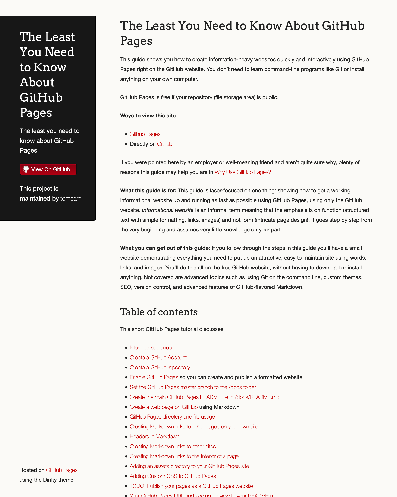
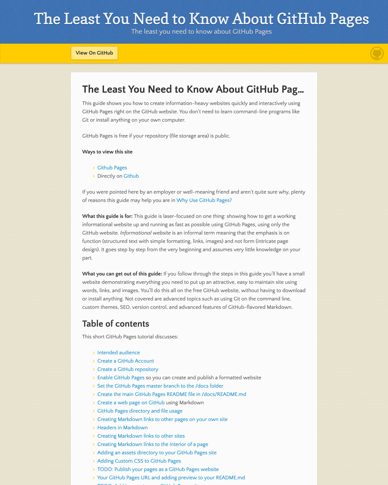

# Change the appearance of your GitHub Pages site using Jekyll themes

Currently when you view your publication on GitHub pages it looks like this:


It's pretty much identical to what you see on GitHub's preview. But GitHub has
a number of built-in themes you can use to alter your publication's appearance
dramatically. You can see them here. Just click on theme and look for a mention of 
its preview mode in the GitHub repo where it resides.

[See official GitHub Pages Jekyll themes here](https://pages.github.com/themes)

## To change the theme, use theme: in _config.yml

Among the GitHub themes are one named `Dinky` and one named `Leap Day`. To use
a theme add the following to `_config.yml`, which should be in the root 
of your repo (the `docs` directory if you've been following along).

### Start with theme: jekyll-theme-

Put the following in `docs/_config.yml` but don't save it yeet:

```
theme: jekyll-theme-
```

### End with the theme name

End the line with the theme name in lowercase. If the theme name has spaces replace
them with dash characters.

### Example: Dinky theme

* To use the Dinky theme, append `dinky` to the `theme` line of `_config.yml`, so
the whole line would read like this:

```
theme: jekyll-theme-dinky
```

Again, even though the theme is named just `Dinky` it must be lowercased and preceded by `jekyll-theme-` as shown in
the previous example.

### Save changes and preview

* Commit (save) the changes and view it in GitHub Pages:



### Example: Leap Day theme

* To see how it works with a theme name containing spaces, try the Leap Day theme. 
Change `_config.yml` as shown here:

```
theme: jekyll-theme-leap-day
```

* And view it in GitHub pages:



[Previous page](adding-assets-directory-github-pages.md) |  [Next page](adding-images-github-pages-site.md)

#### [Home](/README.md) 
